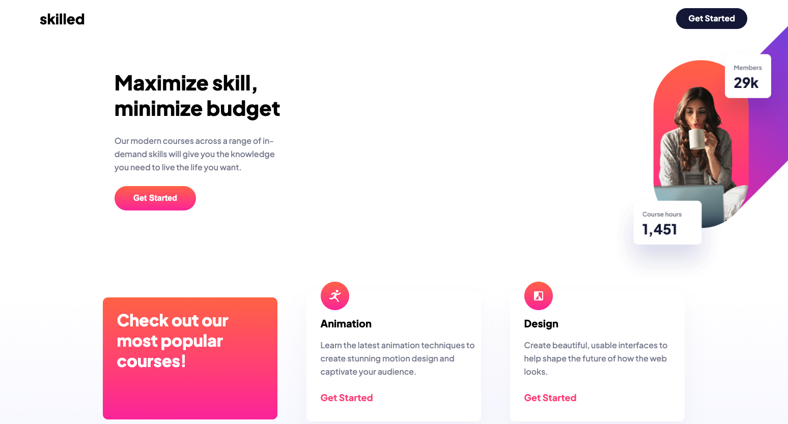
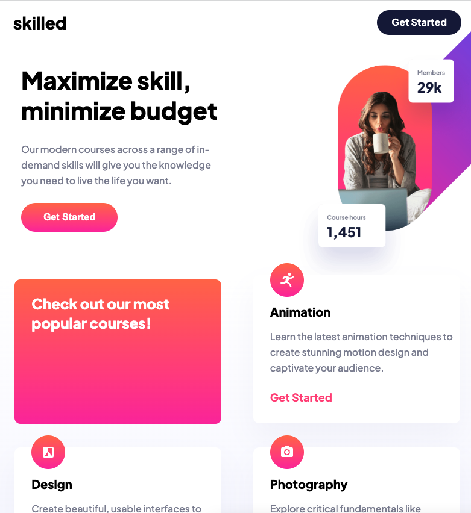
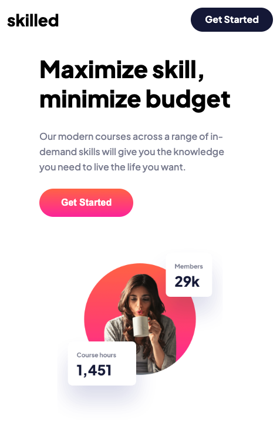

# Frontend Mentor - Skilled e-learning landing page solution<!-- omit in toc -->

## Final solution<!-- omit in toc -->

### Desktop<!-- omit in toc -->

### Tablet<!-- omit in toc -->

### Mobile<!-- omit in toc -->

### Mobile

## Table of contents<!-- omit in toc -->

- [Overview](#overview)
  - [The challenge](#the-challenge)
  - [Links](#links)
- [My process](#my-process)
  - [Built with](#built-with)
  - [What I learned](#what-i-learned)
  - [Useful resources](#useful-resources)
- [Author](#author)

## Overview

### The challenge

Users should be able to:

- View the optimal layout depending on their device's screen size
- See hover states for interactive elements

### Links

- Solution URL: [GitHub repo](https://github.com/awesomeCoding999/frontend-mentor-skilled-elearning-landing-page)
- Live Site URL: [live site](https://awesomecoding999.github.io/frontend-mentor-skilled-elearning-landing-page/)

## My process

### Built with

- Semantic HTML5 markup
- CSS custom properties
- Flexbox
- mobile first design

### What I learned

I learned a lot about absolute position and layouts for different screen sizes in this challenge. I ran into some challenges with the larger design layouts, so that is something that I will need to continue to work on.

### Useful resources

- [CSS Tricks Complete guide to Flexbox](https://css-tricks.com/snippets/css/a-guide-to-flexbox/) - I think this is the best guide to understanding Flexbox.

## Author

- Frontend Mentor - [@awesomeCoding999](https://www.frontendmentor.io/profile/awesomeCoding999)
